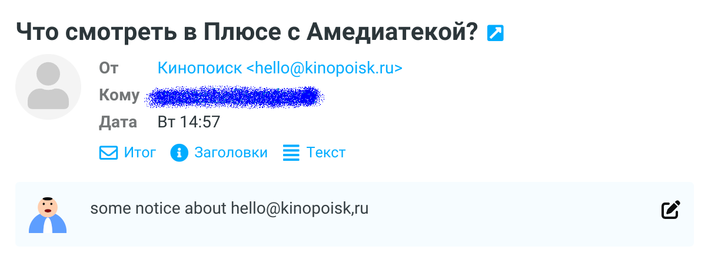

# Roundcube Email User Notes

This plugin allows you to add/show notes about sender(in INBOX)/recipient(in OUTBOX) of your emails.

## Installation
To install, get the plugin with composer in your roundcube directory:

```
composer require moose-kazan/email_user_notes
```

In `config.inc.php`, register the plugin with
```php
$config['plugins'] = [
    'email_user_notes',
];
```

And allow full emails:

```php
$config['message_show_email'] = true;
```

## Screenshots



## License
Permissively licensed under the MIT license

Based on https://github.com/prefo-pl/roundcube-plugin-email-notes

